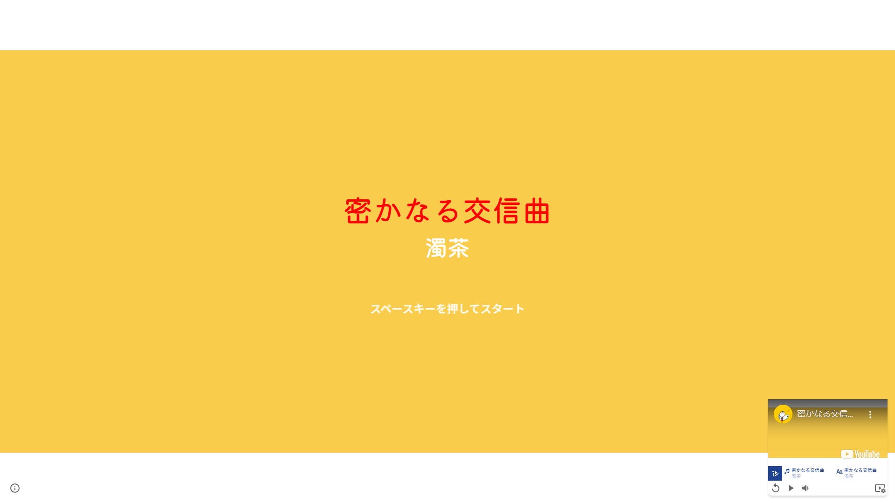
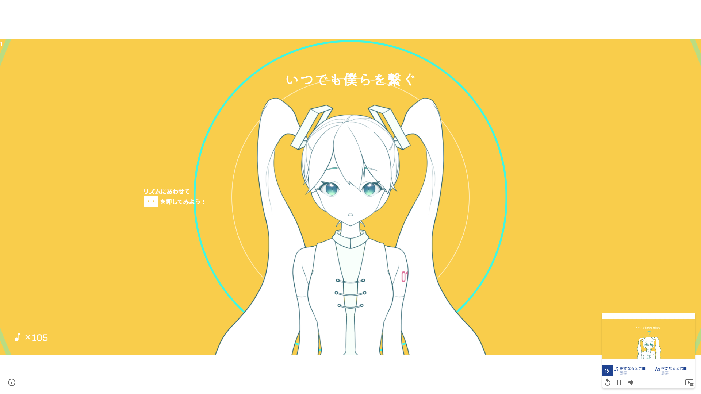
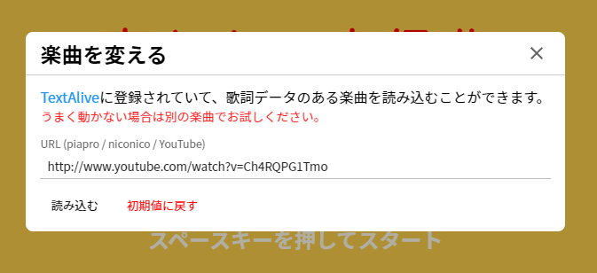

# denpaghost/magical-contest-2021

[denpaghost.github.io/magical-contest-2021](https://denpaghost.github.io/magical-contest-2021)

本リポジトリは 初音ミク「マジカルミライ 2021」プログラミング・コンテスト の応募作品「密かなるにじそうさく」のソースコードです。  
[Apache License, Version 2.0](https://www.apache.org/licenses/LICENSE-2.0.html)に基づき、Google Fonts のフォントとアイコンを利用しています。  
また、TextAlive App API を通じて[TextAlive for Developers](https://developer.textalive.jp/)より楽曲データを取得して使用しています。

# ビルドを行う

Node.js v14.17.2 及び yarn v1.22.10 でビルドができることを確認しております。  
トラブルが発生した場合はこれに近い環境でのビルドをお願いします。

## .env ファイルの作成

`.env`ファイルを作成してください。

`TEXTALIVE_APP_TOKEN`には TextAlive App API のトークンを指定してください  
`BASE_PATH`にはページのルートとなるディレクトリを指定してください。（`https://hoge.jp/fuga`なら`/fuga`、`https://hoge.jp/`ならそのまま）
`FALLBACK_SONG_URL`には初期状態で読み込む楽曲の URL を指定してください。初期設定では濁茶様の「密かなる交信曲」です。

```dotenv
TEXTALIVE_APP_TOKEN="your_token"
BASE_PATH=""
FALLBACK_SONG_URL="https://www.youtube.com/watch?v=Ch4RQPG1Tmo"
```

## ビルド

```shell
# ライブラリの取得
yarn install --frozen-lockfile

# プロジェクトのビルド
yarn export -- -o <任意のディレクトリ>
```

指定したディレクトリにビルドされた Web ページが出力されます。  
出力されたファイルを Web サーバへ配置して、動作を確認してください。

# プログラムを動かす

## 初期画面

ページを開くと以下のように表示されます。



画面下部右側のメディアコントロールより楽曲の再生と一時停止、最初から再生、音量の調節、読み込む楽曲 URL の変更を行うことができます。

画面下部左側のインフォメーションマークをクリックするとこのサイトについての情報を見ることができます。

## 楽曲の再生

楽曲を再生すると画面に様々なアニメーションがあらわれます。



このアニメーションはキーボードの上下左右それぞれのカーソルキー及びスペースキーを押すことで何かが起きたりします。  
何かできそうだ、と感じたら思うままに操作してみてください。

## 読み込む楽曲 URL を変更する

メディアコントロール下部の最も右にあるアイコンをクリックすると「楽曲を変える」モーダルダイアログが表示されます。  
このダイアログのテキストフィールドへ URL を入力し、「読み込む」ボタンをクリックして楽曲の読み込みを行ってください。
初期設定の楽曲に戻すには「読み込む」ボタンの隣の「初期値に戻す」ボタンをクリックしてください。

読み込むことが可能な楽曲は TextAlive による解析がされいる、歌詞データを持っている楽曲に限られます。



## イースターエッグ

楽曲を再生していないときに「3939」とタイプすると...？

# 共同制作者

## デザイン / イラスト制作

nowa 様

## モチーフ利用許諾

濁茶 様  
[濁茶 / ゆうみ lit.link(リットリンク)](https://lit.link/Dakucha)

# 企画・制作

倉重みつき  
[くらしげ 👻 さん (@mi2_ku39) / Twitter](https://twitter.com/mi2_ku39)

with GhostServer  
[GhostServer](https://portal.ghostserver.jp/)

&copy; 2021 Mitsuki Kurashige, GhostServer.
